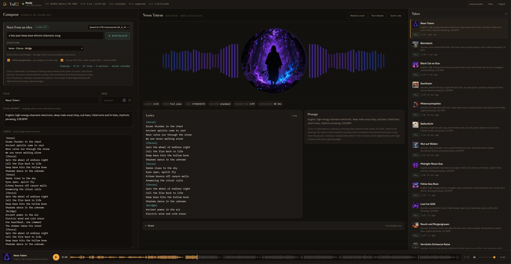
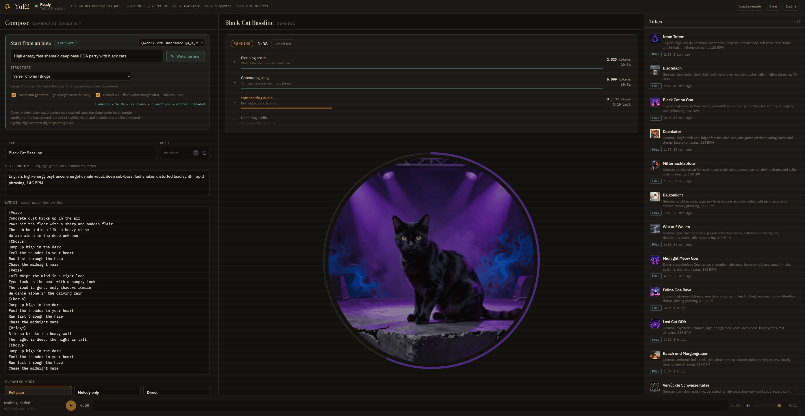

# YuE2 WebUI

A local web console for [YuE2](https://github.com/multimodal-art-projection/YuE), the
open song-generation model. Write a style prompt and lyrics, watch the score get written
token by token, then play the finished song.

Everything runs on your own machine: the song model, the lyric writer, and the cover art.

*A finished take. The sleeve is a disc in the middle of its own waveform, and the
spectrum takes its colours from the artwork.*

*A run in progress. The cover is drawn before the song, so it is already there while
the four stages work, sharpening as they go.*

## Install

Download or clone this repository, then double-click **`install.bat`**.

It checks for an NVIDIA driver, installs Python 3.12 if it is missing, creates a virtual
environment, fetches the CUDA build of PyTorch, installs YuE2 and the console, and offers
to download the model weights. Afterwards, start it any time with **`start-console.bat`**,
which opens the browser once the server is actually listening.

Manual setup and the packaging script are documented in [webui/README.md](webui/README.md).

## What it does

**Start from an idea.** Type one line and a local model writes the title, style prompt,
lyrics and a cover-art description. Two backends: **llama.cpp**, installed into the project
folder from the console with a catalogue of writer models, or **Ollama** if you already run
it. GGUF files you already have are found in your Hugging Face cache.

**Compose.** Style prompt, lyrics with `[Verse]` / `[Chorus]` tags, planning mode, seed, an
optional supplied ABC score and per-stage sampling.

| Mode | `cot` | Use it for |
|---|---|---|
| Full plan | `full` | New songs — melody and chords are written first |
| Melody only | `melody` | Covers — melody fixed, accompaniment free |
| Direct | `off` | Straight from lyrics and style, no editable score |

**Watch the run.** Four stages with live token counts, rates and a countdown: the score
appears as it is written, then the music tokens, the synthesis and the decode.

**Cover or remix.** Reuse a finished take's melody in a new style, or transcribe a recording
with SheetSage2 and cover that. YuE2 takes no audio input, so every cover goes through a
score — the console says so rather than pretending otherwise.

**Cover art.** stable-diffusion.cpp draws a sleeve from the writer's own visual description,
using Z-Image Turbo, Krea 2 Turbo, or any SD/SDXL checkpoint you already have. The prompt is
written for the selected model: full sentences for the LLM-encoder families, tag lists for
CLIP ones.

**Keep the takes.** Every song is a complete `save_artifacts` folder — audio, score, latents
and everything needed to reproduce the run — plus the cover.

## One GPU, shared carefully

The song model, the writer and the art model all want the same card, so the console hands
memory between them instead of hoping it fits:

- The writer is unloaded the moment it answers; with llama.cpp the process is killed
  outright, so nothing survives it.
- The cover is drawn **before** the song model loads, in the window where the GPU is idle.
  It costs no extra wall-clock time.
- After every run the weights move back to the CPU and the CUDA allocator's cache is
  dropped. Without that last step a run's freed blocks stay *reserved* and the card reads
  as full while sitting idle.
- Live VRAM is shown in the top bar, with a **Free VRAM** button beside it.

## Requirements

- Windows 10 or 11, NVIDIA GPU with BF16 and 24 GB of VRAM or more
- Python 3.12 (the installer can fetch it)
- About 15 GB of disk space for the code, PyTorch and the YuE2 weights

The installer uses the CUDA 12.8 build of PyTorch, whose arch list covers `sm_70` through
`sm_120` — Ampere, Ada and Blackwell install identically, so a 4090 and a 5090 need no
different steps.

## Relationship to upstream

This repository contains YuE2 itself plus the console in [`webui/`](webui/). The original
project README is kept as [README-YuE2-upstream.md](README-YuE2-upstream.md).

One upstream file is patched: `src/yue2/cuda_graph.py` decided FlashAttention was available
by checking that the operator was *registered*. Windows CUDA wheels register it without
compiling the kernels, so the first decode step died with
`USE_FLASH_ATTENTION was not enabled for build`. The probe now runs one tiny call and falls
back to cuDNN attention when it fails. This affects the plain CLI as much as the console.

## Licence

First-party code is **Apache 2.0**, as upstream. The model weights are licensed separately
under **CC BY-NC 4.0** — non-commercial use only. See [LICENSE](LICENSE) and
[MODEL_LICENSE](MODEL_LICENSE).
